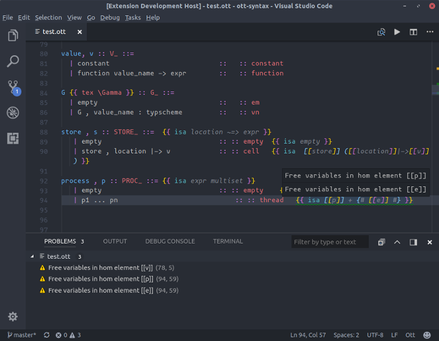

# ott-vscode

Provides syntax highlighting and inline error reporting 
for the [Ott semantics tool](http://www.cl.cam.ac.uk/~pes20/ott/).



## Features

### Syntax Highlighting 

The emphasis is on visually distinguishing the meta-language from the language being modeled.
As a result, the files end up quite colorful.

I've optimized this for the One Dark Pro theme, but it should look okay with any theme. Some
classes might not get distinguished if your theme doesn't define colors for enough scopes, though.

I'm no expert when it comes to visual design, so pull-requests are welcome with regards
to the color choices.

### Inline Error Reporting

When you save your file, it will be run with `ott` and any errors will be reported inline. 

By default, `ott` is run with no arguments. However, if the first line of your file contains a magic comment of the form:

```% !Ott args = "ARGS"``` 

Then, Ott will be run with whatever args are given. This is useful for re-generating
LaTeX or proof-assistant code automatically when you save.

## Requirements

The command `ott` must be installed and on your `$PATH`.

Syntax highlighting recognizes some languages within the `hom` blocks,
if you have a language pack installed for that language.
Reccomended packages to allow this are:

* [VSCoq](https://marketplace.visualstudio.com/items?itemName=siegebell.vscoq) or [Coq](https://marketplace.visualstudio.com/items?itemName=ruoz.coq)
* [Isabelle](https://marketplace.visualstudio.com/items?itemName=makarius.isabelle)
* [LaTeX Workshop](https://marketplace.visualstudio.com/items?itemName=James-Yu.latex-workshop) or [LaTeX Language Support](https://marketplace.visualstudio.com/items?itemName=torn4dom4n.latex-support)

## Extension Settings

None so far.

## Known Issues

* No option to specify `ott` binary location
* Check-on-save always on, should be optional
* Not all errors have location (requires changes to Ott to fix)
* Error parsing is hacky, so some errors may not be reported

## Future features

- [ ] Source-code formatting
- [ ] Inline unicode replacement, something like [prettify-symbols-mode](https://marketplace.visualstudio.com/items?itemName=siegebell.prettify-symbols-mode). 

## Contributing

Contributions are welcome and encouraged! Feel free to leave any issues or submit pull requests.
Alternately, if you would like to collaborate, I will happily add collaborators to the repo.

## Release Notes

### [ 0.0.1 ]

- Initial release

### [ 0.0.2 ]
- Improved and cleaner error parsing
- Add back brackets to surrounding pairs, remove single quotes (messes up with prime variables)
- Logo and screenshot added

## [ 0.0.3 ]
- Remove ansi-strip dependency
- Add output from Ott binary to "Output" pane 